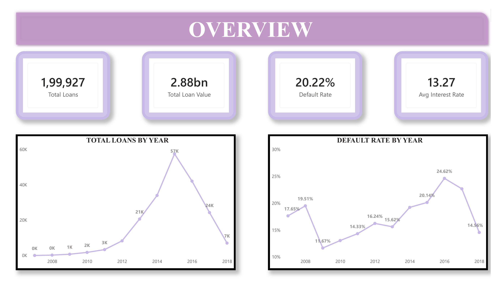
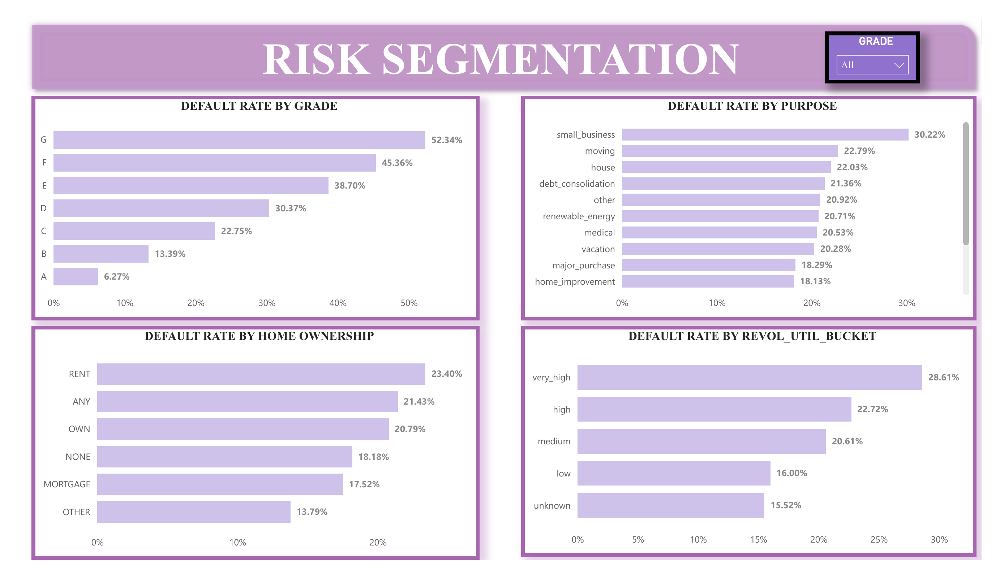
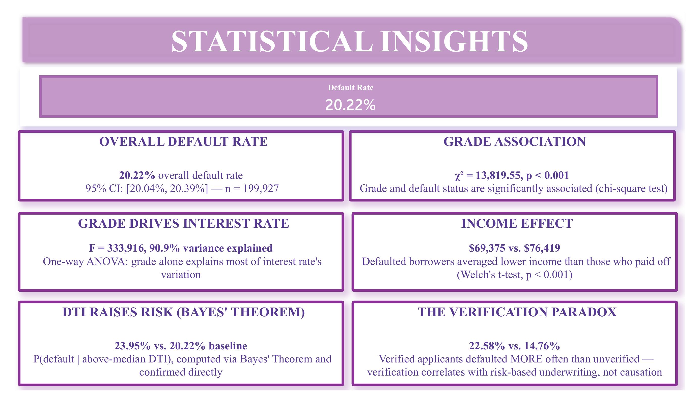

# Bank Loan Default Risk Analytics

End-to-end data analytics project demonstrating Python, statistics, feature engineering,
EDA, SQL, Power BI, Snowflake, and AWS on a real-world credit risk dataset.

## Architecture

Kaggle CSV → AWS S3 (data lake) → Snowflake (warehouse + SQL transforms) →
Python (statistics, EDA, feature engineering) → Power BI (dashboard) → GitHub/LinkedIn (portfolio)

## Dashboard

**Overview** — portfolio KPIs and loan volume/default rate trends over time


**Risk Segmentation** — default rate broken down by grade, purpose, home ownership, and credit utilization


**Statistical Insights** — the Step 7 hypothesis test results, surfaced as reference cards


The full `.pbix` file is in [`dashboards/`](dashboards/) if you'd like to explore it directly.

## Progress

- [x] **Step 1** — Environment setup (AWS, Snowflake, GitHub, Python)
- [x] **Step 2** — SQL foundation (load raw data, exploratory SQL)
- [x] **Step 3** — Data classification (types, scales of measurement, sampling)
- [x] **Step 4** — Descriptive statistics (central tendency, dispersion, correlation)
- [x] **Step 5** — Probability distributions & Central Limit Theorem
- [x] **Step 6** — Feature engineering
- [x] **Step 7** — Inferential statistics & hypothesis testing
- [x] **Step 8** — Consolidate notebook, write engineered data back to Snowflake
- [x] **Step 9** — Power BI dashboard
- [ ] **Step 10** — Documentation, GitHub/LinkedIn packaging — in progress

## Setup

```bash
git clone <your-repo-url>
cd loan-default-analytics
python -m venv venv
source venv/bin/activate   # Windows: venv\Scripts\activate
pip install -r requirements.txt
cp .env.example .env       # then fill in your real AWS + Snowflake credentials
```

Run the Snowflake setup script (`sql/00_setup_warehouse_db_schema.sql`) in a Snowflake
worksheet, then verify everything is wired up:

```bash
python scripts/verify_setup.py
```

## Project structure

```
loan-default-analytics/
├── README.md
├── requirements.txt
├── .env.example
├── data/
│   ├── raw/                          # original + cleaned CSVs (git-ignored)
│   └── processed/                    # engineered dataset (git-ignored)
├── sql/
│   ├── 00_setup_warehouse_db_schema.sql
│   ├── 01_create_raw_loans_table.sql
│   └── 02_exploratory_queries.sql
├── aws/
│   └── iam_policy_s3_readwrite.json
├── notebooks/
│   ├── data_utils.py                 # shared load + cleaning logic
│   ├── feature_engineering.py        # shared feature engineering logic
│   ├── 01_data_understanding.py      # Step 3
│   ├── 02_descriptive_statistics.py  # Step 4
│   ├── 03_probability_distributions.py  # Step 5
│   ├── 04_feature_engineering.py     # Step 6
│   ├── 05_hypothesis_testing.py      # Step 7
│   └── 06_load_engineered_to_snowflake.py  # Step 8
├── scripts/
│   ├── verify_setup.py
│   ├── prepare_raw_data.py           # Step 2
│   └── load_to_snowflake.py          # Step 2
├── reports/
│   └── figures/                      # charts generated by Steps 4-5
└── dashboards/
    ├── loan_analytics.pbix
    └── screenshots/
```

## Dataset

[Lending Club Loan Data (Kaggle)](https://www.kaggle.com/datasets/adarshsng/lending-club-loan-data-csv)

## Key findings

- **Grade is the dominant risk signal.** Default rate climbs from ~6% at grade A to ~52% at grade G (chi-square test of independence, chi2 = 13,819.55, p < 0.001). A one-way ANOVA shows grade alone explains 90.9% of the variance in interest rate (SSB/SST) — expected, since Lending Club's own pricing model sets interest rate directly from grade/sub-grade.
- **Income is a real, if modest, predictor.** Defaulted loans came from borrowers with significantly lower average income ($69,375) than paid-off loans ($76,419) — a two-sample Welch's t-test rejects the null of equal means (p = 2.1e-206). `annual_inc` is Log-Normal, not Normal (raw skewness 2.16, log-transformed skewness 0.01), so it was log-transformed before use.
- **High DTI meaningfully raises default risk.** Bayes' Theorem and a direct calculation agree: P(default | above-median DTI) = 23.95%, vs. an overall default rate of 20.22%.
- **Income verification correlates with, but doesn't cause, higher default.** Verified applicants defaulted at 22.58% vs. 14.76% for unverified (two-proportion z-test, p < 0.001) — most likely because lenders verify income specifically for riskier-looking applications, not because verification itself raises risk.
- **The overall default rate is 20.22%** (95% CI: [20.04%, 20.39%]).
- **Data quality issues found and handled:** `annual_inc` had a small number of unverified self-reported outliers up to $9.2M, winsorized at the 99.5th percentile; `dti` had 73 rows (0.04%) with implausible values (including an exact `999` sentinel), which were dropped.

### Methodology notes
- Welch's t-test (not Student's) was used throughout to avoid assuming equal variances between groups.
- The one-way ANOVA's homogeneity-of-variance assumption is technically violated per Levene's test (p ≈ 0) — expected given n≈200,000, where even trivial differences reach significance. The conclusion is robust regardless: F = 333,916 and a 90.9% variance-explained figure aren't sensitive to this violation, but a Welch's ANOVA would be the more rigorous choice in a stricter analysis.
